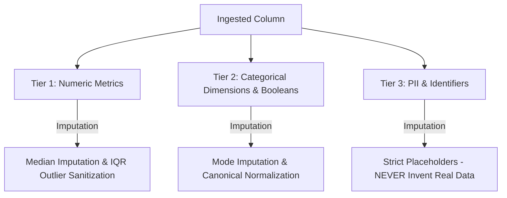

# Data Cleaning Agent Rule Book
**Multiagent Data Analytics & BI Engine**  
*Deterministic Rule Engine & LLM Strategy Specification*

---

## 1. Core Architecture & Guiding Philosophy

The Cleaning Agent is built on a **Strict 2-Phase Separation of Concerns**:

1. **Phase 1: LLM Strategy (Intelligence)**: The LLM analyzes the dataset profile (null percentages, unique counts, sample values, data types) and business intent to output a structured list of `CleaningOperation` objects.
2. **Phase 2: Deterministic Rule Engine (Zero Code Generation)**: The engine executes pre-compiled, deterministic Polars expressions (`pl.Expr`). **No arbitrary Python or LLM-generated code is ever executed**. This eliminates hallucinations, prevents memory corruption, and provides sub-second execution speeds.
3. **Safety Guarantee**: In the event of an LLM timeout or invalid response, a deterministic **Heuristic Scanner** automatically analyzes schema metadata and generates the exact required operations.

---

## 2. The 3-Tier Semantic Classification System

Every column in an ingested dataset is classified into one of three semantic tiers, each governed by non-negotiable data governance rules:

### Tier 1 — Numeric Metrics
- **Examples**: `UnitPrice`, `TotalAmount`, `Quantity`, `Age`, `Height_cm`, `Weight_kg`, `BillingAmount`, `Tax`, `Discount`.
- **Governing Rule**: Numerical properties must be preserved. Never use mode or mean when skewness is present.
- **Null Threshold ($2\% \le \text{null\_pct} \le 50\%$)**: Impute missing values using the **column median** (`drop_nulls().median()`).
- **Mixed Formats**: Currency symbols (`$`, `€`, `£`, `₹`, `¥`), thousand-separators (`,`), and trailing currency codes (`USD`, `EUR`) are stripped before numeric conversion.
- **Outliers**: Outliers are identified via Tukey's IQR boundaries ($[Q_1 - 1.5 \times \text{IQR}, Q_3 + 1.5 \times \text{IQR}]$) and domain constraints ($> 0$), then re-imputed with the median.

### Tier 2 — Categorical Dimensions, Temporal & Booleans
- **Examples**: `Gender`, `Country`, `State`, `City`, `Status`, `Department`, `BloodType`, `EmploymentType`, `Is_Active`, `DateOfBirth`.
- **Governing Rule**: Ambiguities, casing variances, typos, and abbreviations must be resolved into standardized canonical forms.
- **Null Threshold ($2\% \le \text{null\_pct} \le 50\%$)**: Impute missing values using the **non-null mode** (`drop_nulls().mode().first()`).
- **Dates**: Mixed representations must be unified into ISO `YYYY-MM-DD` standard dates without discarding valid calendar records.

### Tier 3 — PII & Primary Identifiers
- **Examples**: `PatientID`, `CustomerID`, `OrderID`, `CustomerName`, `DoctorName`, `Email`, `PhoneNumber`, `SSN`.
- **Governing Rule**: **NEVER fake, invent, or impute real identities with statistical metrics (no median/mode)**.
- **Identifiers (`ID`, `Key`)**: Preserved untouched. Missing IDs are left unfilled or flagged; duplicate IDs undergo deduplication.
- **Names / Entities**: Impute with explicit placeholders (e.g. `"Unknown Customer"`, `"Unspecified"`).
- **Emails**: Validate structure (`@` and domain). Invalid or missing emails become `"N/A"`.
- **Phones**: Strip non-digit characters (preserve leading `+`). Validate digit lengths ($7 \le \text{len} \le 15$). Mark out-of-range as `"Invalid"` and missing as `"Unspecified"`.

---

## 3. Deterministic Order of Operations

The order in which operations execute on a column is strictly enforced. Outlier removal or parsing must never be performed after null imputation, as that would introduce permanent missing values:

| Priority | Stage | Operation | Rationale |
| :---: | :--- | :--- | :--- |
| **0** | **Structural Integrity** | `deduplicate`, `remove_duplicates` | Removes duplicate rows and ghost/all-null records before calculating statistics. |
| **1** | **Column Pruning** | `drop_column` | Discards unusable columns ($>50\%$ nulls) early to eliminate redundant processing. |
| **2** | **Text Cleaning** | `trim_whitespace`, `strip`, `clean_text` | Strips leading/trailing spaces and collapses inner multiple spaces. |
| **3** | **Date Parsing** | `parse_date`, `standardize_date` | Converts multi-format date strings into real Date types using fallback coalescence. |
| **4** | **Type Casting** | `cast_type`, `safe_numeric_cast` | Strips currency symbols and punctuation; parses clean integers or floats. |
| **5** | **Normalization** | `normalize`, `normalize_categorical` | Expands abbreviations, canonicalizes booleans, standardizes countries, statuses, and blood types. |
| **6** | **Outlier Removal** | `remove_outlier`, `domain_bounds` | Identifies extreme/impossible values via IQR domain rules and clears them to `null`. |
| **7** | **Null Imputation** | `fill_null` | Imputes remaining missing cells AND newly cleared outliers via median, mode, or placeholder. |

---

## 4. Factor-by-Factor Cleaning Rule Matrix

| Factor / Data Anomaly | Detection Condition | Operation | Strategy | Applied Transformation | Example Before $\rightarrow$ After |
| :--- | :--- | :--- | :--- | :--- | :--- |
| **Duplicate Records** | Identical rows across non-ID columns | `deduplicate` | `remove_duplicates` | `lf.unique(maintain_order=True)` | Repeated row $\rightarrow$ 1 unique row |
| **High Missing Column** | $\text{null\_pct} > 50\%$ (and not Primary Key/ID) | `drop_column` | `drop` | `lf.drop(col)` | Column dropped from schema |
| **Padding Whitespace** | Text column with leading/trailing spaces | `trim_whitespace` | `strip` | `pl.col(c).cast(Utf8).str.strip_chars()` | `"  Berlin  "` $\rightarrow$ `"Berlin"` |
| **Mixed Date Formats** | Column contains slash, dash, or text dates | `parse_date` | `standardize_date` | `pl.coalesce([to_date(fmt) for fmt in FMTS])` | `"22-Apr-73"`, `"28-03-1983"` $\rightarrow$ `1973-04-22`, `1983-03-28` |
| **Text in Numeric Column** | Currency/commas in Price, Amount, Salary | `cast_type` | `safe_numeric_cast` | Regex strip `[$€£₹¥,]` $\rightarrow$ extract number $\rightarrow$ `Float64` | `"$1,250.50"` $\rightarrow$ `1250.50` |
| **Gender Variants** | Single-letter or lowercase codes | `normalize` | `normalize_categorical` | Map via `GENDER_MAP` | `"m"`, `"F"`, `"Male"` $\rightarrow$ `"male"`, `"female"` |
| **Boolean Variants** | `1/0`, `y/n`, `true/false`, `active/inactive` | `normalize` | `normalize_categorical` | Map via `BOOL_MAP` | `"Y"`, `"1"`, `"active"` $\rightarrow$ `"yes"`, `"yes"`, `"yes"` |
| **Country Variants** | Country codes & mixed casing | `normalize` | `normalize_categorical` | Map via `COUNTRY_MAP` $\rightarrow$ Title Case | `"usa"`, `"uk"`, `"deu"` $\rightarrow$ `"United States"`, `"United Kingdom"`, `"Germany"` |
| **Employment Types** | Abbreviations & contract variants | `normalize` | `normalize_categorical` | Map via `EMPLOYMENT_TYPE_MAP` | `"ft"`, `"part time"`, `"temp"` $\rightarrow$ `"Full-Time"`, `"Part-Time"`, `"Contract"` |
| **Status Fields** | Mixed casing and common typos | `normalize` | `normalize_categorical` | Map via `STATUS_MAP` $\rightarrow$ Title Case | `"termnated"`, `"on leave"`, `"A"` $\rightarrow$ `"Terminated"`, `"On Leave"`, `"Active"` |
| **Blood Type / Serology** | Word variants and typo `0` | `normalize` | `normalize_categorical` | Word replace `pos` $\rightarrow$ `+`, `0` $\rightarrow$ `O` $\rightarrow$ Uppercase | `"b positive"`, `"0+"`, `"a-"` $\rightarrow$ `"B+"`, `"O+"`, `"A-"` |
| **General Text Casing** | Irregular uppercase/lowercase text | `normalize` | `normalize_categorical` | Collapse multi-space $\rightarrow$ Title Case | `"CARDIOLOGY"`, `"dept  two"` $\rightarrow$ `"Cardiology"`, `"Dept Two"` |
| **Numerical Outliers** | Value outside $[Q_1 - 1.5\text{IQR}, Q_3 + 1.5\text{IQR}]$ or $<0$ | `remove_outlier` | `domain_bounds` | Replace with `None` (queued before median fill) | Height `5.4 cm`, Weight `-82.6 kg` $\rightarrow$ `None` $\rightarrow$ Median |
| **Missing Numeric Value** | Numeric column with missing cells | `fill_null` | `median` | `pl.col(c).fill_null(c.drop_nulls().median())` | `null` $\rightarrow$ `166.5` (Column median) |
| **Missing Categorical** | Categorical column with missing cells | `fill_null` | `mode` | `pl.col(c).fill_null(c.drop_nulls().mode().first())` | `null` $\rightarrow$ `"A+"` (Column non-null mode) |
| **Missing PII / Customer** | Name or Contact column with missing cells | `fill_null` | `placeholder_replacement` | Replace with `"Unknown Customer"` | `null` $\rightarrow$ `"Unknown Customer"` |
| **Malformed Email** | Missing `@` symbol or domain structure | `fill_null` | `null_invalid_email` | Check `@` $\rightarrow$ fill `"N/A"` | `"bad-email"` $\rightarrow$ `"N/A"` |
| **Malformed Phone** | Non-digits or character count $<7$ or $>15$ | `fill_null` | `placeholder_replacement` | Strip non-digits $\rightarrow$ length check | `"123"` $\rightarrow$ `"Invalid"`, `null` $\rightarrow$ `"Unspecified"` |

---

## 5. Specific Factor Specifications

### 5.1 Multi-Format Date Parsing
The engine tests 14 common date patterns using deterministic fallback coalescence:
1. `%Y-%m-%d` (ISO standard: `2023-01-15`)
2. `%d/%m/%Y` (International: `15/01/2023`)
3. `%m/%d/%Y` (US standard: `01/15/2023`)
4. `%Y/%m/%d` (Alternative ISO: `2023/01/15`)
5. `%d-%m-%Y` (Dash international: `28-03-1983`)
6. `%m-%d-%Y` (Dash US: `03-28-1983`)
7. `%d-%b-%y` (Two-digit year month name: `22-Apr-73`, `31-Aug-24`)
8. `%d-%b-%Y` (Four-digit year month name: `22-Apr-1973`)
9. `%b %d %Y` (Text date no comma: `May 18 2023`)
10. `%b %d, %Y` (Text date with comma: `May 18, 2023`)
11. `%B %d %Y` (Full month name: `January 15 2023`)
12. `%B %d, %Y` (Full month with comma: `January 15, 2023`)
13. `%d.%m.%Y` (Dot international: `15.01.2023`)
14. `%Y.%m.%d` (Dot ISO: `2023.01.15`)

### 5.2 Sentinel String Hardening
At dataset ingestion, before schema profiling, the following textual tokens are stripped and normalized to `NULL`:
- Empty strings (`""`) and whitespace padding
- General missing markers: `"n/a"`, `"na"`, `"null"`, `"none"`, `"nan"`, `"undefined"`
- Healthcare & survey sentinels: `"unknown"`, `"Unknown"`, `"UNKNOWN"`

### 5.3 Outlier Handling & Post-Imputation
- **Statistical Rule**: Computed per column via LazyFrame:
  $$\text{IQR} = Q_3 (75\text{th percentile}) - Q_1 (25\text{th percentile})$$
  $$\text{Lower Bound} = Q_1 - 1.5 \times \text{IQR}, \quad \text{Upper Bound} = Q_3 + 1.5 \times \text{IQR}$$
- **Post-Imputation Pairing**: Whenever an operation removes outliers from a numeric column, the engine automatically pairs it with a subsequent `fill_null` with strategy `"median"`. This ensures extreme anomalies are eradicated without lowering the dataset completeness score.

---

## 6. Data Quality Score & Verification Metrics

Data Quality is measured across three mathematically bound sub-scores:

### 1. Completeness (Overall Score)
$$\text{Completeness} = 1.0 - \left(\frac{\text{Total Null Cells}}{\text{Total Rows} \times \text{Total Columns}}\right)$$
- **Target**: $>95\%$ (and must strictly increment after cleaning).

### 2. Uniqueness
$$\text{Uniqueness} = \frac{1}{\text{Columns}} \sum_{c=1}^{\text{Columns}} \frac{\text{Count of Distinct Values in Column } c}{\text{Total Rows}}$$
- Tracks information density and duplicate row purging.

### 3. Type Consistency
$$\text{Type Consistency} = \frac{1}{\text{Columns}} \sum_{c=1}^{\text{Columns}} \frac{\text{Count of Non-Null Values Matching Expected Type}}{\text{Total Non-Null Values in Column } c}$$
- Evaluates whether date columns contain valid dates, numeric columns contain valid floats/integers, and boolean columns contain binary values. Target: $100\%$.
