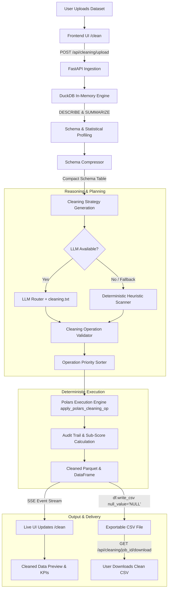
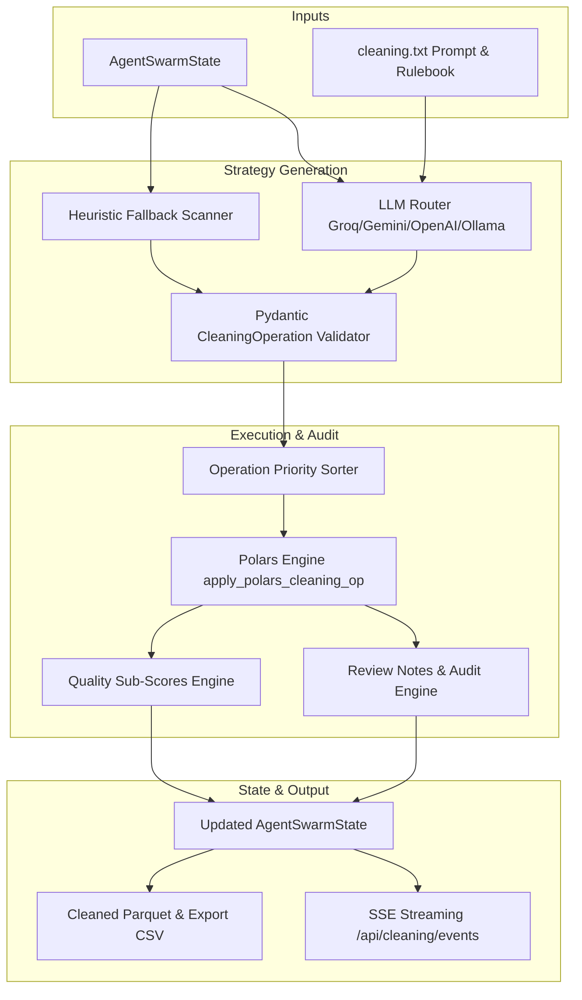
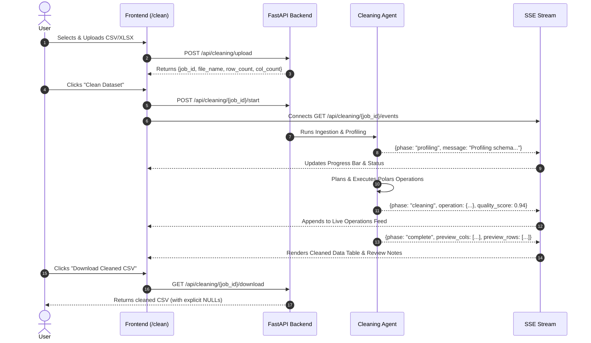
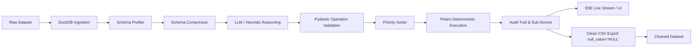

# Cleaning Agent — AutoBI

The **AutoBI Cleaning Agent** is the automated data preparation engine within the AutoBI platform. Its purpose is to transform messy, unstandardized tabular business data into clean, typed, analysis-ready datasets for downstream BI dashboards, SQL analytics, and feature engineering.

The Cleaning Agent operates under a strict architectural design: **LLMs perform reasoning, profiling interpretation, and rule selection, while a high-performance Polars/DuckDB engine deterministically executes all transformations.**

---

## 1. Overview

### What the AutoBI Cleaning Agent Does
The Cleaning Agent ingests raw tabular datasets, analyzes schema definitions and statistical distributions, identifies data quality anomalies, plans an ordered sequence of conservative cleaning operations, and applies deterministic transformations using Polars and DuckDB.

### Why It Is Required in the BI Pipeline
Raw business data is rarely dashboard-ready. Uploaded files often contain:
- Mixed date formats and invalid timestamps.
- Unnormalized phone numbers and dirty email addresses.
- Inconsistent categorical casing and boolean variations (`yes`/`no`, `1`/`0`, `T`/`F`).
- Statistical outliers that skew aggregate metrics.
- Missing values in critical dimension or metric columns.
- Currency symbols and unparsed numeric strings.

Downstream analytics and visualization engines require strict types, consistent categories, and reliable numbers. The Cleaning Agent bridges this gap autonomously without requiring manual data wrangling.

### Core Problem Solved
Traditional automated cleaning tools either:
1. Rely purely on rigid scripts that fail on varied formats, or
2. Allow generative LLMs to hallucinate or directly rewrite numeric values, compromising business data integrity.

AutoBI solves this by enforcing a **zero-hallucination, conservative, audit-logged cleaning pipeline**:
- Operations are planned from a strict, predefined vocabulary.
- Imputation never invents numbers when no safe rule applies.
- Critical columns (such as `Age` and unresolvable contact numbers) are preserved as `NULL` and flagged in human-readable review notes rather than silently distorted.

### Current Implementation Scope
The current implementation covers single-table tabular datasets (CSV, XLSX, JSON, Parquet) with end-to-end support for schema profiling, heuristic and LLM-assisted cleaning rule generation, deterministic Polars execution, live Server-Sent Events (SSE) updates, quality sub-score auditing, and explicit `NULL`-preserving CSV exports.

---

## 2. End-to-End Workflow

The following flowchart illustrates the complete lifecycle of a dataset from user upload to clean CSV download:



---

## 3. Ingestion Agent / Data Understanding

### Separation of Concerns
- **Ingestion Agent**: Responsible for securely loading raw files, registering them into the DuckDB engine, inferring base physical data types, computing null percentages, unique value counts, and detecting initial semantic types.
- **Cleaning Agent**: Consumes the structured profile produced during Ingestion and is strictly responsible for *transforming* and *standardizing* the data.

### Loading and Supported File Types
Data ingestion is managed via [`DuckDBEngine`](file:///c:/Users/Admin/Documents/AutoBI/Multi-Agent-BI-Engine/backend/core/duckdb_engine.py). Supported formats include:
- **CSV**: Loaded via DuckDB's `read_csv_auto()` with automatic delimiter and header inference.
- **Parquet**: Loaded via native `read_parquet()`.
- **JSON / JSONL / NDJSON**: Loaded via `read_json_auto()`.
- **Excel (XLSX)**: Loaded into memory via PyArrow/Polars and registered into DuckDB.

### Profiling and Semantic Understanding
During ingestion, DuckDB executes:
1. `DESCRIBE <table>`: Extracts column names, storage types, and nullability.
2. `SUMMARIZE <table>`: Computes distribution stats (min, max, unique counts, null percentages, quartiles, mean, std).
3. Sample extraction: Captures the first 5 representative rows.

Columns are classified into semantic types:
`"identifier"`, `"metric"`, `"dimension"`, `"date"`, `"currency"`, `"percentage"`, `"boolean"`, `"text_description"`, `"geographic"`, or `"unknown"`.

### Schema Compression
To optimize token efficiency when sending context to the LLM, [`compress_column_meta_for_prompt()`](file:///c:/Users/Admin/Documents/AutoBI/Multi-Agent-BI-Engine/backend/core/schema_compressor.py) converts verbose metadata into a compact Markdown table, reducing prompt token usage from ~8,000 tokens to ~600 tokens:

```text
| Column               | Type    | Semantic   | Null% | Uniq% | PK | KPI | Sample             |
|----------------------|---------|------------|-------|-------|----|-----|--------------------|
| Employee_ID          | BIGINT  | identifier | 0%    | 100%  | Y  | N   | 1001, 1002         |
| Age                  | BIGINT  | metric     | 19%   | 45%   | N  | N   | 28, 45             |
| Salary               | DOUBLE  | currency   | 12%   | 88%   | N  | Y   | $75,000, 82000     |
| Joining_Date         | VARCHAR | date       | 5%    | 90%   | N  | N   | 2021/04/12, 15-08-20 |
```

This compressed representation is passed directly into the Cleaning Agent's state ([`AgentSwarmState`](file:///c:/Users/Admin/Documents/AutoBI/Multi-Agent-BI-Engine/backend/core/state.py)).

---

## 4. Cleaning Agent Architecture



### Major Architectural Components
1. **Cleaning Prompt / Rulebook ([`backend/prompts/cleaning.txt`](file:///c:/Users/Admin/Documents/AutoBI/Multi-Agent-BI-Engine/backend/prompts/cleaning.txt))**: Defines the strict vocabulary of operations, parameter boundaries, and conservative cleaning principles.
2. **LLM Strategy Generator ([`backend/core/llm_router.py`](file:///c:/Users/Admin/Documents/AutoBI/Multi-Agent-BI-Engine/backend/core/llm_router.py))**: Calls the LLM to inspect anomalies, infer business meaning, and output a JSON array of `CleaningOperation` objects.
3. **Heuristic Scanner ([`backend/agents/cleaning_node.py`](file:///c:/Users/Admin/Documents/AutoBI/Multi-Agent-BI-Engine/backend/agents/cleaning_node.py))**: A robust rule-based scanner that automatically detects issues and builds operations if the LLM is unreachable or returns invalid output.
4. **Operation Priority Sorter**: Re-orders planned operations into an execution sequence that prevents dependency conflicts (e.g., dropping empty columns before imputing).
5. **Deterministic Polars Executor**: Executes transformations using compiled Polars expressions.
6. **Audit & Review Notes System**: Captures skipped columns, preserved nulls, and data anomalies for human review.
7. **State Management**: Persists intermediate snapshots in `AgentSwarmState` and supports checkpoint saving/loading.

---

## 5. Cleaning Strategy & Principles

### Guiding Principles
1. **Separation of Reasoning and Execution**: The LLM *never* runs Python code or modifies numbers directly; it only selects operations, strategies, and rationales.
2. **Business-Meaning Preservation**: Values used for financial or business decisions must not be silently invented.
3. **Conservative Decision Rule**:
   > *"Determine whether the missing value can be safely resolved according to the column's semantic type and cleaning rules. If it cannot be safely resolved, preserve it as missing and record an appropriate review note. The presentation layer may display missing values as N/A."*

### Reasoning vs. Deterministic Processing
- **Reasoning Phase (LLM / Heuristic Scanner)**: Identifies patterns (e.g., detecting that `"12-05-2023"` and `"2023/05/12"` belong to a date column; recognizing that `"contact_no"` has inconsistent country codes).
- **Execution Phase (Polars)**: Performs exact, reproducible operations on all rows simultaneously.

---

## 6. Important Cleaning Rules

The following table summarizes the core rules currently implemented in the Cleaning Agent rulebook:

| Data Problem | Current Strategy | Result |
| :--- | :--- | :--- |
| **Leading / Trailing Whitespace** | `trim_whitespace` | Cleans all string columns, removing leading/trailing spaces and internal multi-spaces. |
| **Mixed Boolean Variants** | `normalize` (strategy: `boolean`) | Standardizes `true`, `false`, `1`, `0`, `yes`, `no`, `y`, `n`, `t`, `f` into canonical boolean types. |
| **Severely Empty Columns** | `drop_column` | Columns with null percentage $> 80\%$ (non-ID) are safely dropped to reduce noise. |
| **Mixed Date Formats** | `parse_date` (strategy: `iso8601`) | Parses multiple date formats (`YYYY-MM-DD`, `DD/MM/YYYY`, `MM-DD-YYYY`) into standard `YYYY-MM-DD`. |
| **Inconsistent Categorical Casing** | `normalize` (strategy: `titlecase` / `lowercase`) | Standardizes string casing to eliminate duplicate category buckets. |
| **Dirty / Malformed Emails** | `clean_email` | Lowercases strings, removes invalid characters, validates domain structure. |
| **Generic Missing Numeric** | `fill_null` (strategy: `median` or `mean`) | Fills missing values using median (if skewed) or mean (if normal). Excludes identifiers and protected columns. |
| **Generic Missing Categorical** | `fill_null` (strategy: `mode` or `constant: "Unknown"`) | Fills missing low-cardinality values with the most frequent value or marks as `"Unknown"`. |
| **Duplicate Records** | `deduplicate` | Removes completely duplicate rows while preserving unique records. |
| **Extreme Statistical Outliers** | `remove_outliers` (strategy: `iqr_clip` or `zscore`) | Clips or filters extreme numeric anomalies exceeding $3 \times \text{IQR}$ or $3.0 \times Z$-score. |
| **Currency Symbols in Text** | `normalize` (strategy: `strip_currency`) | Strips `$`, `€`, `£`, `₹`, and thousand commas; casts column to numeric `DOUBLE`. |
| **Salary / Integer Formats** | `cast_type` (strategy: `integer`) | Strips non-numeric characters, parses numeric value, and preserves integer precision without decimal artifacts. |
| **Low-Quality / Unresolvable Values** | `preserve_null` + `review_note` | Unresolvable values are preserved as backend `NULL` and recorded in `review_notes`. |

---

### Special Age Rule

> **Universal Age Protection Rule**:
> *"Age columns must NEVER be automatically imputed with mean, median, mode, or invented defaults. Missing or invalid Age values must be preserved as backend NULL and recorded in `review_notes` for human owner review."*

#### Architectural Enforcement
In [`cleaning_node.py`](file:///c:/Users/Admin/Documents/AutoBI/Multi-Agent-BI-Engine/backend/agents/cleaning_node.py#L425-L445), **Rule 2.5 (Age Protection)** executes before generic numeric imputation (Rule 7). Regardless of whether DuckDB detected the `Age` column as `BIGINT`, `DOUBLE`, or `VARCHAR`:
1. Any non-numeric string representations (e.g. `"N/A"`, `"unknown"`, negative values) are cast to `NULL`.
2. Missing values are **never** imputed with mean or median.
3. A structured record is added to `state.review_notes`:
   ```json
   {
     "column": "Age",
     "issue": "Missing or unresolvable values preserved as NULL",
     "action": "Preserved as backend NULL without synthetic imputation. Human owner review recommended."
   }
   ```

---

### Special Contact / Phone Number Rule

#### Country-Aware Normalization
Phone cleaning implements international format standardization:
1. **Punctuation & Delimiter Stripping**: Removes spaces, hyphens, brackets, and periods (`+91-98765-43210` &rarr; `9876543210`).
2. **Country Code Handling**: Recognizes common international prefixes (e.g., `+91`, `+1`, `+44`). When a known country prefix is detected, it strips leading regional prefixes and standardizes the national number length.
3. **Invalid / Partial Number Handling**: Numbers with insufficient digits or corrupt characters that cannot be resolved are safely converted to backend `NULL` and logged in `review_notes`.

---

## 7. Cleaning Operation Execution

### Operation Representation (`CleaningOperation`)
Every transformation is represented as a validated Pydantic model:

```python
class CleaningOperation(BaseModel):
    column: str
    operation: Literal["fill_null", "remove_outliers", "normalize", "cast_type",
                       "drop_column", "deduplicate", "trim_whitespace", "parse_date", "clean_email"]
    strategy: str
    rows_affected: int
    before_nulls: int
    after_nulls: int
    polars_code: str
    rationale: str
```

### Deterministic Priority Ordering
Operations are executed in strict priority order to prevent race conditions:

| Priority | Operation | Reason |
| :---: | :--- | :--- |
| **1** | `drop_column` | Remove completely invalid or unusable columns first. |
| **2** | `deduplicate` | Eliminate redundant rows before calculating column metrics. |
| **3** | `trim_whitespace` | Clean raw string padding before regex or type matching. |
| **4** | `normalize` | Standardize currencies, booleans, and casing. |
| **5** | `clean_email` | Clean email addresses before type verification. |
| **6** | `parse_date` | Convert date strings to temporal types. |
| **7** | `cast_type` | Enforce proper physical types (Integer, Float, etc.). |
| **8** | `remove_outliers` | Handle extreme statistical anomalies. |
| **9** | `fill_null` | Impute missing values last on clean, standardized columns. |

### Execution Logic (`apply_polars_cleaning_op`)
Each operation is applied via Polars expressions. Polars executes the expression, tracks the before/after null counts and rows affected, and produces the updated DataFrame.

```text
Raw Value:     "+91-98765-43210"
Operation:     normalize (strategy: "phone_country_aware")
Clean Value:   "9876543210"
```

---

## 8. UI Workflow (`/clean`)

The AutoBI frontend provides an interactive, live-streaming cleaning console at `/clean`.



### Backend Endpoints Used by the UI
- `POST /api/cleaning/upload`: Uploads and parses the raw dataset into DuckDB.
- `POST /api/cleaning/{job_id}/start`: Initiates background cleaning.
- `GET /api/cleaning/{job_id}/events`: Streams live status events, operations, and sub-scores via Server-Sent Events (SSE).
- `GET /api/cleaning/{job_id}/state`: Retrieves the current `AgentSwarmState` snapshot.
- `POST /api/cleaning/{job_id}/resume`: Resumes an interrupted job from the last checkpoint.
- `GET /api/cleaning/{job_id}/download`: Streams the final cleaned CSV file.

---

## 9. CSV Export & NULL Representation

A critical requirement in data engineering is distinguishing between backend storage, frontend presentation, and file export representations:

| Layer | Representation | Purpose |
| :--- | :--- | :--- |
| **Backend (DuckDB / Polars)** | Native `NULL` (`None`) | Preserves numerical type safety, aggregation accuracy (`AVG`, `SUM`), and indexing. |
| **Frontend UI (`/clean`)** | `N/A` (Styled Badge) | Clean visual presentation for human readability. |
| **Exported CSV** | Explicit string `"NULL"` | Standard SQL/BI ingestion format (`df.write_csv(..., null_value="NULL")`). |

```python
# Actual implementation in backend/api/cleaning_demo.py
buf = io.BytesIO()
cleaned_df.write_csv(buf, null_value="NULL")
buf.seek(0)
```

This ensures downstream BI tools, data warehouses (Snowflake, BigQuery, Postgres), and analytics engines ingest missing values properly without interpreting blank strings as zero or missing categories as `"N/A"`.

---

## 10. Data Quality Problems Handled

| Category | Problem Type | Handled in Current Implementation |
| :--- | :--- | :---: |
| **Completeness** | Missing numerical values (mean/median imputation) | ✅ |
| | Missing categorical values (mode/constant imputation) | ✅ |
| | Protected Age missing values (preserved as NULL) | ✅ |
| | Unresolvable missing values (preserved + review note) | ✅ |
| **Validity** | Mixed date formats (`YYYY/MM/DD`, `DD-MM-YYYY`) | ✅ |
| | Malformed email addresses | ✅ |
| | Non-numeric characters in currency columns | ✅ |
| | Inconsistent phone numbers & country prefixes | ✅ |
| **Consistency** | Inconsistent categorical casing (Titlecase/Lowercase) | ✅ |
| | Inconsistent boolean representations (`yes/no`, `1/0`, `t/f`) | ✅ |
| | Leading, trailing, and multi-whitespace | ✅ |
| **Uniqueness** | Exact duplicate records | ✅ |
| **Accuracy** | Statistical outliers ($> 3 \times \text{IQR}$) | ✅ |
| **Relevance** | Severely empty / unusable columns ($> 80\%$ missing) | ✅ |

---

## 11. Technical Stack

The table below lists the technologies and libraries used in the Cleaning Agent:

| Technology / Library | Version / Role | Function in Cleaning Workflow |
| :--- | :--- | :--- |
| **Python** | `3.13` | Core runtime for backend execution. |
| **FastAPI** | `^0.110.0` | High-performance REST API and SSE streaming backend. |
| **DuckDB** | `^1.1.0` | In-memory analytical database for fast data loading, schema profiling, and SQL summaries. |
| **Polars** | `^1.0.0` | High-speed columnar DataFrame engine for executing deterministic cleaning transformations. |
| **PyArrow** | `^15.0.0` | Zero-copy memory bridge between DuckDB and Polars. |
| **Pydantic v2** | `^2.6.0` | Strict data validation for `AgentSwarmState`, `ColumnMeta`, and `CleaningOperation`. |
| **LLM Router** | Multi-Provider | Manages LLM calls to Groq, Gemini, OpenAI, Anthropic, or local Ollama models with automatic fallbacks. |
| **Next.js / React** | `14+` / React `18` | Interactive web dashboard providing the `/clean` data cleaning interface. |
| **Server-Sent Events** | Native Asyncio SSE | Real-time streaming of cleaning operations, logs, and quality scores to the browser. |

---

## 12. Reliability, Auditability & Error Handling

### Review Notes & Skipped Columns
- `state.review_notes`: Records actions where automatic imputation was intentionally avoided (e.g., protected `Age` columns, unresolvable phone numbers).
- `state.skipped_columns`: Records columns intentionally left untouched (e.g., high-cardinality primary keys, text descriptions).

### Data Quality Score & Sub-Scores
The agent calculates an overall quality score along with detailed sub-scores:
- **Completeness**: Evaluates non-null ratios across columns.
- **Validity**: Measures adherence to recognized formats (dates, emails, phones).
- **Consistency**: Evaluates casing uniformity and duplicate ratios.

### Fault Tolerance & Checkpointing
- **Exponential Backoff**: LLM API calls implement exponential backoff (1s, 2s, 4s delays for HTTP 429/500/503 errors) across providers.
- **Heuristic Fallback**: If LLM providers are unavailable or fail validation, the agent automatically executes the deterministic heuristic scanner, ensuring zero pipeline interruption.
- **Checkpoint Persistence**: State snapshots are serialized via `CheckpointManager` to local disk and PostgreSQL, enabling resumption via `POST /api/cleaning/{job_id}/resume`.

---

## 13. Testing and Verification

The Cleaning Agent test suite covers unit logic, rulebooks, state models, pipeline integration, and end-to-end dataset processing:

### Current Test Suite Verification
- **105 Cleaning Agent Specific Tests Passed** across 5 test suites:
  - [`backend/tests/unit/test_cleaning_finalization.py`](file:///c:/Users/Admin/Documents/AutoBI/Multi-Agent-BI-Engine/backend/tests/unit/test_cleaning_finalization.py): 41 tests (Age protection, Salary integer casting, phone normalization, explicit NULL CSV export).
  - [`backend/tests/unit/test_cleaning_rulebook.py`](file:///c:/Users/Admin/Documents/AutoBI/Multi-Agent-BI-Engine/backend/tests/unit/test_cleaning_rulebook.py): 46 tests (individual rule execution across all 15 cleaning strategies).
  - [`backend/tests/unit/test_cleaning_improvements.py`](file:///c:/Users/Admin/Documents/AutoBI/Multi-Agent-BI-Engine/backend/tests/unit/test_cleaning_improvements.py): 16 tests (quality sub-scores, audit trails, skipped column tracking).
  - [`backend/tests/unit/test_cleaning_node.py`](file:///c:/Users/Admin/Documents/AutoBI/Multi-Agent-BI-Engine/backend/tests/unit/test_cleaning_node.py): 1 test (node orchestration and state updates).
  - [`backend/tests/test_user_csv_cleaning.py`](file:///c:/Users/Admin/Documents/AutoBI/Multi-Agent-BI-Engine/backend/tests/test_user_csv_cleaning.py): 1 test (real-world dirty dataset end-to-end execution).
- **147 Total Backend Unit Tests Passed** (including checkpoint/resume, router, and ingestion tests).
- Real-world dirty employee and sales datasets (`Messy_Employee_dataset.csv`, `clean_sales.csv`) verified end-to-end through both automated test runners and the live UI.

---

## 14. Current Limitations

1. **Cross-Column Multi-Variable Imputation**: Missing value imputation operates on a per-column basis; multivariate regression or predictive imputation based on correlated columns is planned for future releases.
2. **Ambiguous Natural Language Dates**: Dates written as ambiguous relative strings (e.g. `"last Tuesday"`, `"Q3 FY22"`) are flagged rather than guessed.
3. **International Phone Numbers Without Format Hints**: Phone numbers lacking country codes or possessing non-standard digit lengths are preserved as `NULL` with a review note rather than heuristically rewritten.

---

## 15. Final Workflow Summary


